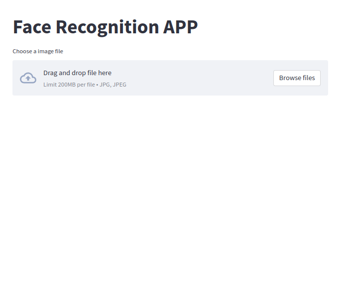
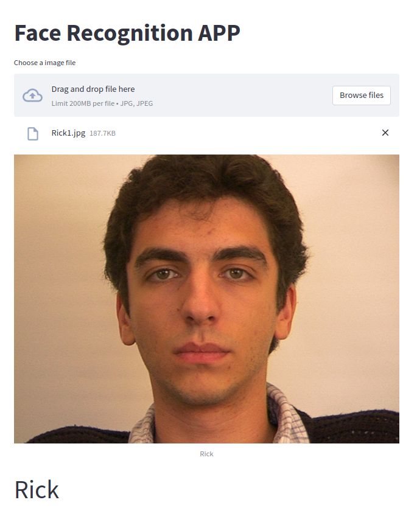

## このアプリについて

FaceNet(https://arxiv.org/pdf/1503.03832.pdf) を用いた顔認証アプリケーション

## 顔認証フロー

1. 顔画像をアップロード

2. 顔検出実施

3. 検出した画像から顔画像の特徴量ベクトルを抽出

4. 抽出した特徴量ベクトルおよび計算済み特徴量ベクトル間のコサイン類似度を計算する。

5. コサイン類似度が最大となる人物を同一人物であるとして名前を表示する(ただし、コサイン類似度の最大値がしきい値以下の場合は登録されていない顔とする。)。

## 環境構築

1. Docker イメージをビルドする。

```
docker build -t face-recognition-with-facenet .
```

2. Docker コンテナを立ち上げる

```
docker run -it --rm -p 8888:8888 -v <本ディレクトリへの絶対パス>:/home/jovyan/work face-recognition-with-facenet
```

3. `http://localhost:8888/`にアクセスして、Browse files から画像をアップロードする(下画像参照)。



4. アップロードが完了すると、下記のような画面遷移する。



## その他

1. そもそも顔が検出できない場合は、`face not found`というメッセージが表示されるようにしている。

2. 登録されていない顔に対しては、`face note registered`というメッセージが表示されるようにしている。

3. 画像ベクトルの抽出から実施したい場合は、以下に示す手順を実施すること

   1. ./data/data.zip を解凍して、下記のようなディレクトリ構成になるようにする。

      ```
      ./data
          |-test/
          |_train/
      ```

   2. find_threshold.py を実行する。
